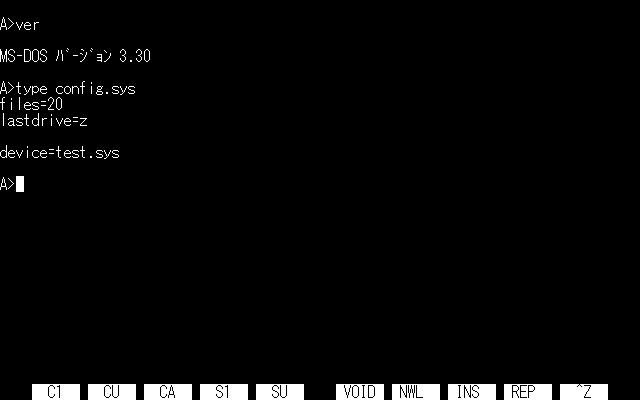
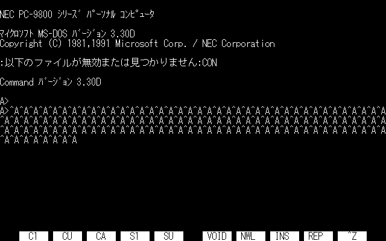
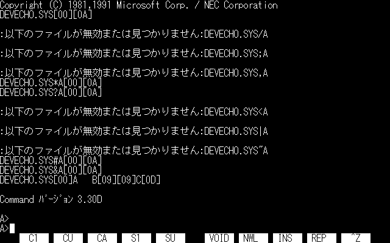
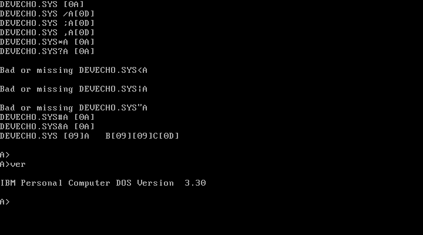
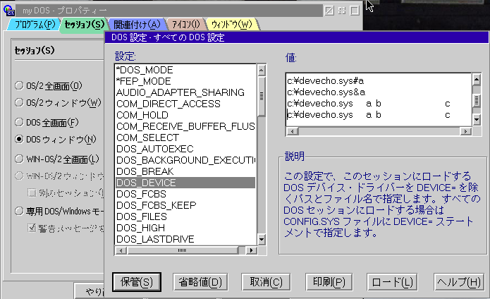
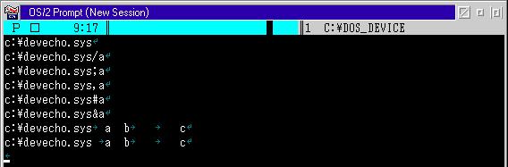
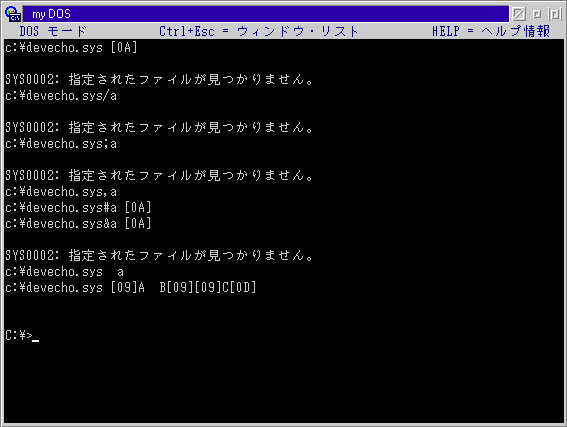

# いまさら人が聞かないDOSデバイスドライバ開発の小技

「人に訊けない」というものでもないな…本当にいまさらだし…（これ書いてるの西暦2023年なので…）

## 1. INIT（初期化）

### 1.1 文字型デバイスを常駐させずに終了する（DOS 2.x～4.0）

少なくともIBM DOS 5.0のプログラマーズリファレンスマニュアルには、デバイスドライバの非常駐終了の正式な手順が公開されていた。
リクエストヘッダのユニット数を0に、終了アドレスをデバイスヘッダの先頭（一般的なドライバではCS:0000）に設定することで正常終了する。
（ちなみにNECのMS-DOS 5.0プログラマーズリファレンスマニュアルには記述がない）

DOS2～4で正しい手順が公開されることはなかった。
DOS 5で公開された方法で正常に非常駐終了できるのはブロックデバイスだけで、文字型デバイスを同じ手順で終了するとMS-DOSはハングアップする。

 

多少荒業になるが、終了際にデバイスヘッダを操作してブロックデバイスに成り済ますことで、とりあえず正常終了できるようになる。
DOS5以上相当の互換DOSやメモリ環境設定ツール、サードパーティ製のデバイスドライバ読み込みツールなどとの相性が悪いので、バージョンチェックを行ってDOS 4以下の場合だけ特別な処理を行うのが安全だと思われる。

サンプルソース : [devecho.asm](./samples/devecho.asm)

### 1.2 デバイスドライバ初期化時の引数

初期化時にドライバに渡されるドライバ名と引数は、必ずしもCONFIG.SYSのDEVICE(HIGH)文に書かれた通りの文字列になっているわけではなく、若干の「加工」が施されており、しかも環境によって微妙に内容が異なることがある。

* すべての英小文字は大文字に変換される。つまりデバイスドライバには小文字のオプションを渡すことができない（ちなみにINSTALL文も同じ仕様なので、小文字のオプションが必要な常駐プログラムはINSTALL文で常駐させない方がいい）。
* 文字列の終端は「CRもしくはLF」であり（これはMS-DOS公式仕様）、CRとLFのどちらで終わるかは記述次第で変わるため、どちらか先に出た方を受け入れなければならない。ヌルコードは終端ではない。
* NEC PC-98もしくはエプソン互換機用のMS-DOSでは、ほとんどの場合、デバイスドライバのファイル名とその後の引数の間にヌルコードが挿入される。
文字列中のヌルコードをスキャンすることでドライバの引数部分の処理をすこし簡略化できるが、このような処理が行われるDOSはおそらく98系のMS-DOSとWindows9xのみである（PC-98用WindowsNT/2000のNTVDMでの挙動は確認していない）。

サンプルドライバDEVECHO.SYS（ソース:[devecho.asm](./samples/devecho.asm)）を使って、実際にデバイスドライバに渡される引数を見てみることにする。
このドライバは初期化時に渡された引数をそのまま画面に表示し、常駐せずにそのまま終了する。
ただし制御コード(0x00～0x1F)の場合は16進コードを表示する。たとえばヌル文字は[00]、CRは[OD]、LFは[0A]、タブ文字は[09]と表示する。

以下のようなCONFIG.SYSの場合、

	files=20
	buffers=20
	
	device=devecho.sys
	device=devecho.sys/a
	device=devecho.sys;a
	device=devecho.sys,a
	device=devecho.sys*a
	device=devecho.sys?a
	device=devecho.sys<a
	device=devecho.sys|a
	device=devecho.sys"a
	device=devecho.sys#a
	device=devecho.sys&a
	device=devecho.sys	a   b		c

PC-98用のMS-DOS 3.3Dでは以下のような結果になる。

また、IBM PC用のIBM PC DOS 3.30では以下のような結果になる。

PC DOS 3.30ではドライバ名直後にスペースを空けずにスラッシュ、セミコロン、コンマを書いても空白コード(0x20)が挿入され、正しく引数と解釈できるようになっている。
PC-98のMS-DOSではこの状態でドライバが読み込まれない。
直後に*、?、#、&を書いた場合は読み込めているが、空白やヌルコードが挿入されるのはその後なので「ドライバ名の一部」と解釈されていると思われる。

（どちらのDOSも引数がある場合の行末コードはCRで、ない場合はLFになっているように見える。なぜそんなことになってしまったのか…）

ついでに32ビットOS/2のDOSセッション(MVDM)でも試してみた。
MVDM起動時のデバイスドライバ導入はプロパティのセッションタブにあるDOS設定のDOS_DEVICEにドライバのパス名と引数を記述する（DEVICE=文は不要）。

DOS_DEVICEに以下のような設定を行った場合、

DOSセッション起動時の結果は以下のようになった。

OS/2のMVDMではドライバ名が大文字化されないほか、PC DOSと異なりドライバ名の直後にスラッシュ、セミコロン、コンマ、そしてタブ文字(!)を書いた場合はドライバが読み込まれないらしい。
（OS/2のMVDMはDOS環境の互換性を謳い文句のひとつにしていたが、デバイスドライバの導入部分に関しては、他にも.COM型ドライバが導入できないなど、やや互換性に難がある）

